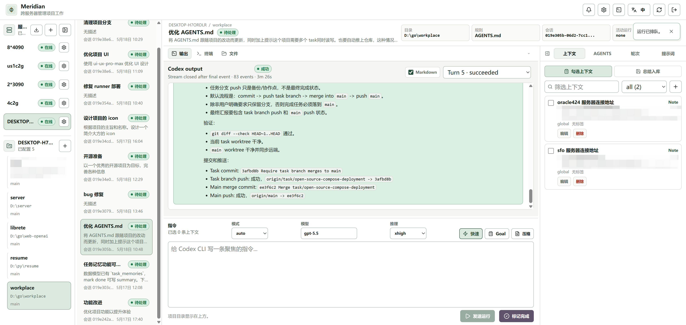

# Meridian

<p align="center">
  
</p>

[English](README.en.md) | 中文


[](https://linux.do/)

Meridian 是一个通过 Web 管理任务的控制台。它把多台设备、多个项目、多个任务放到一个界面里，让你随时打开浏览器，一键切换设备、项目和任务。自动提炼任务摘要，需要时可手动选择传入其他设备、项目、任务上下文。

Meridian 不替代 Codex，也不重新实现 agent。真正执行任务的仍然是目标设备上的 Codex CLI。

Meridian 所做的是在每台设备上运行一个设备代理，在控制台来管理多个设备上的 Codex。

## 适用场景

- 在不止一台设备上使用 Codex CLI，需要统一入口。
- 维护多个项目，需要快速切换到对应设备上的项目和任务。
- 希望手动选择其他任务和过往上下文，后续任务不用从头开始。
- 同时把多个工作交给 Codex，只需在任务完成或失败时回到控制台查看结果。
- 不放心把复杂任务一股脑推给 Hermes/OpenClaw。亲手把关各个任务。

## 和常见方案的区别

| 方案 | 主要体验 | Meridian 的差异 |
| --- | --- | --- |
| Hermes / OpenClaw | 通用 agent、个人自动化、跨工具编排。 | 不做新的 agent runtime，亲自把关 Codex CLI。 |
| IDE + AI | 在编辑器里写代码，也可以通过远程开发连接服务器。 | 用 Web 在不同设备、项目、任务之间切换，不需要为每个任务反复打开窗口、连接服务器、启动 Codex。 |
| Codex App / CLI | 直接和 Codex 交互，APP 也可以连接服务器运行。 | 服务器无需拥有公网 IP 也可被控制，工作台保存在 Meridian，不依赖相同的 APP 登录环境。 |

Meridian 的重点不是“更聪明”，而是“更好管理”：Web 可访问、设备可切换、项目可切换、任务可继续。

## 界面预览

<p align="center">
  
</p>

## 快速开始

Docker Compose 是推荐的部署方式。它会启动 PostgreSQL、启动后端、自动应用数据库迁移、构建设备代理文件，并服务 Web UI。

```bash
git clone https://github.com/Wangzx233/Meridian.git
cd Meridian
docker compose up -d --build
```

浏览器打开：

```text
http://<server-ip>:18080
```

如果只在本机试用，也可以打开 `http://127.0.0.1:18080`。Compose 默认监听所有地址，部署到服务器后通常可以直接通过服务器 IP 访问。第一次浏览器访问会进入初始化管理员账号流程。

需要修改端口、数据库密码、外部数据库或认证配置时：

```bash
cp .env.example .env
vi .env
docker compose up -d --build
```

面向公网或多人使用时，建议放到 HTTPS 反向代理后面。如果 Meridian 只需要被本机反向代理访问，可以在 `.env` 中设置 `MERIDIAN_HTTP_BIND=127.0.0.1`。

## 源码部署
[部署指南](docs/deployment.md)

## 连接第一台设备

每台执行任务的设备都需要先安装 Codex CLI。随后直接使用 Meridian 页面里的安装脚本：

1. 打开 Web UI，点击右上角的 Runner 安装按钮。
2. 将 Control URL 设置为目标设备能访问到的 Meridian 地址。
3. 复制 UI 里给出的 Linux、macOS 或 Windows 命令，并在目标设备上运行。
4. 安装成功后左侧服务器列表自动出现设备。

远程设备不要使用 `127.0.0.1`，除非 Meridian 也运行在同一台设备上。Docker Compose 和源码部署都会提供安装端点所需的设备代理文件，通常不需要手写下载命令。

## 常用流程

1. 打开 Web UI。
2. 在设备下创建项目，并设置真实 `workdir`。
3. 创建任务。
4. 每次发送一条用户指令。
5. 在 Output、Terminal 和 Files 中查看项目与运行状态。
6. 持续追加 turn，直到工作完成。
7. 如果需要将这次任务纳入长期记忆，在“总结入库”生成草稿并入库。
8. 手动将任务标记为 done。

## 手机端和 PWA 使用

Meridian 可以直接在 iOS 和 Android 浏览器里使用。窄屏下，设备、项目和
任务切换会收进顶部的工作区选择器；上下文、历史和 Prompt 等工具会作为
默认收起的底部抽屉打开，可点击或下滑抽屉手柄收起；终端入口会在手机端
隐藏。指令输入框保留语音按钮：支持 Web Speech 的浏览器可以直接转写，
不支持时可聚焦输入框后使用系统键盘自带的麦克风。

前端内置 Web App Manifest 和保守的 Service Worker，可以添加到手机主屏幕。
面向多人或远程手机访问时建议使用 HTTPS；麦克风授权、浏览器通知和安装
体验在安全上下文下更稳定。

## 其他部署方式

不使用 Docker Compose 时，可以采用源码部署。后端默认在启动时自动应用数据库迁移，首次部署不需要额外执行迁移命令；设备代理仍然通过页面右上角提供的安装脚本连接。

源码部署、外部数据库、环境变量、反向代理和 Windows 备注见 [部署指南](docs/deployment.md)。

## 核心能力

| 能力 | 说明 |
| --- | --- |
| 多设备 | 管理安装了设备代理的机器，并跟踪在线状态。 |
| 真实项目目录 | 每个项目绑定到某台设备上的真实工作目录。 |
| 长任务 | 一个任务可以包含多次 Codex turn，成功运行不等于任务完成。 |
| Codex 会话恢复 | 保存 Codex CLI session id，后续 turn 可继续同一任务上下文。 |
| 显式上下文 | 用户手动选择少量、可见的上下文项。 |
| 实时输出 | 设备代理将 Codex run event 流式传回控制台。 |
| 项目工具 | 支持项目文件浏览、轻量编辑和项目目录内终端命令。 |
| 设备代理分发 | 后端提供 Linux、macOS、Windows 设备代理安装端点。 |
| 及时通知 | 任务完成后可选择UI、游览器、邮件三种提醒方式 |

## 架构速览

```text
Browser UI
  -> Go backend control plane
  -> PostgreSQL task/run/event store

Go backend control plane
  <-> device agent WebSocket
  <-> target device agent
  -> local Codex CLI in the project workdir
```

## 当前限制

- 认证是简单登录门禁，没有自助注册或细粒度权限模型。
- 设备代理安装端点面向可信环境。
- 设备代理 artifacts 暂未签名。
- Codex CLI 需要在执行任务的设备上单独安装。
- 目前只支持手动上下文选择，不做自动推荐或注入。
- 成功的 Codex run 不会自动完成任务，必须由用户手动标记 done。

## 相关文档

- [部署指南](docs/deployment.md)：源码部署、外部数据库、环境变量和反向代理。
- [贡献指南](CONTRIBUTING.md)：本地开发环境、检查和 PR 约定。
- [安全策略](SECURITY.md)：安全边界、漏洞报告和部署建议。
- [变更日志](CHANGELOG.md)：版本发布记录。
- [需求文档](docs/requirements.md)：产品需求和范围。
- [架构文档](docs/architecture.md)：控制平面、设备代理和数据模型。
- [API Contract](docs/api-contract.md)：HTTP、SSE 和 WebSocket 协议。
- [发布清单](docs/release-checklist.md)：发布前检查项。
